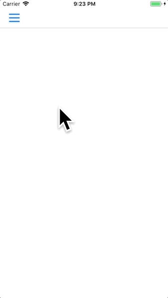

# SwiftSliderMenu




此專案將 側邊選單滑動的機制 跟 側邊選單長怎樣 分離，  
套件只處理前者，側邊選單長怎樣就讓使用者自己客製。


## 設定
先將 `SliderMenuManager.swift` 拉近專案裡，  
並在適當的時機點，指定 SliderMenu 要加在哪個畫面上面，
範例專案的例子是加到 UINavigationController 的 view 上面 :

 
 ```swift

 func application(_ application: UIApplication, didFinishLaunchingWithOptions launchOptions: [UIApplicationLaunchOptionsKey: Any]?) -> Bool {
        
    window?.makeKeyAndVisible()
    
    if let naviVC = window?.rootViewController as? UINavigationController {
        SliderMenuManager.shared.setup(inView: naviVC.view) { () -> UIView in
            return MenuView.instance()
        }
    }
    
    return true
 }
 ```
 
其中 `MenuView` 是自己客製的選單 View。
 

## 顯示選單

 
```swift
SliderMenuManager.shared.showMenu()
```
 
## 隱藏選單
 
```swift
SliderMenuManager.shared.hiddenMenu()
```
 